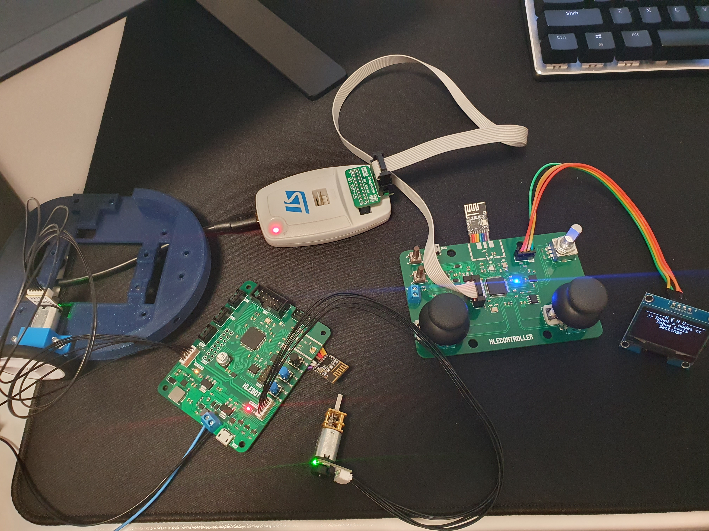
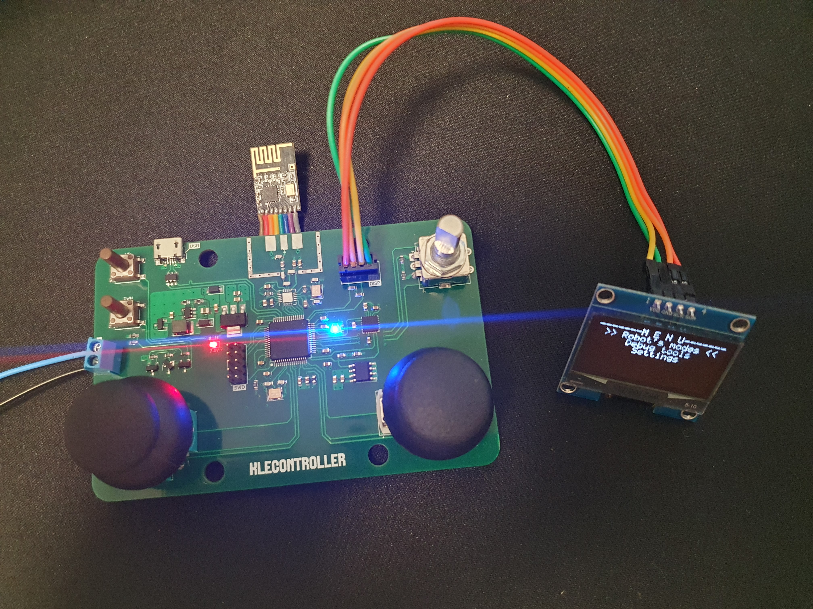

# Klebot

Klebot is a two-wheel multifunctional robot with a wireless remote controller. The main aim of Klebot project is to make a one robot with most popular functionalities which can be seen in this types of robots.

## Introduction
The Klebot project includes two separate devices - remote controller and robot itself. Communication between these two devices is based on 2.4GHz radio freqency.  

The main features of Klebot:
* Automatic driving with avoiding obstacles
* Line foller
* Manual remote steering from controller
* User programmable multi-purpose RGB LED lights

The controller device is responsible for whole control uder the robot. User can launch desired type of functionality and set different settings using controller. 

## Work progress

### Hardware
- [x] Hardware requirements
- [x] Electronic schematics
- [x] PCBs v1.0
- [ ] Schematics corrections
- [ ] PCB v1.1

### Software
- [x] CubeMX configurations
- [x] Menu library for controller
- [x] Controllers inputs handling
- [x] Radio communication process
- [x] Scheduler for handling multiple work modes on both devices (in progress, almost done)
- [x] Basic H - Bridge (DRV8836) driver for robot
- [ ] PID controll for motors module (using encoder)
- [ ] WS2822 adressable LED driver
- [ ] SRF-05 Proximity sensor driver (started)
- [ ] Reflection sensor driver
- [ ] Gyroskope nad accelerometer driver
- [ ] Free ride mode program
- [ ] Obstacles avoiding program
- [ ] Line follower program
- [ ] Saving user configuration to external EEPROM

Opis statusu pracy projektu, czy jest w fazie rozwoju, stabilny, czy może wymaga testów.

## Hardware description
### Controller
The PCB for robot is based on STM32F411RCT6, Cortex-M4 microcontroller. Periphelars placed on PCB:
* Inputs - Incemental encoder, analog joysticks and 2 buttons
* NRF24L01+ for radio communication with controller (SPI)
* M24C02 EEPROM memory (I2C)
* MPU6050 gyroscope accelerometer (I2C)
* USB (serial port only)
* Socket for OLED display (I2C)
* Power is provided by 5V boost converter with 3.3V stabilizer (device is designed for being powered by 18650 Li-Ion battery)

 ### Robot
The PCB for robot is based on STM32F107RCT6, Cortex-M3 microcontroller. Periphelars placed on PCB:
* Inputs - 3 buttons
* NRF24L01+ for radio communication with controller (SPI)
* M24C02 EEPROM memory (I2C)
* MPU6050 gyroscope accelerometer (I2C)
* DRV8866 Dual channel H-Bridge IC
* USB (serial port only)
* Sockets for: 2 DC motors with encoder, OLED Display (I2C), 2x WS2882 LED Strips, QTR Reflective sensor, SRF-05 Proximity sensor
* Power for logic is provided by 5V boost converter with 3.3V stabilizer, power for motors is provided by separate 6V boost converter (device is designed for being powered by 18650 Li-Ion battery)

### Known hardware issues
* antenna circuit for NRF24L01 not working - temporary solution for PCBs v1.0 is attaching extarnal module with the same IC (dedicated pads predicted)
* Soft-start latchup circuit not working - bypass startup

## Photos

 sync

